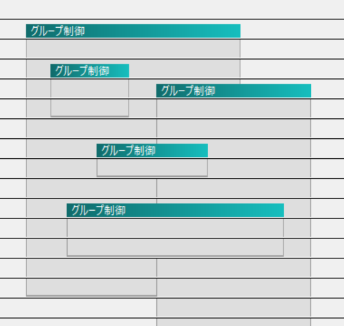

# 真・グループ制御

真・グループ制御（authentic-grouping.auf）は、AviUtl 拡張編集のグループ制御の機能を改善する AviUtl プラグインです。

## 機能

グループ制御を入れ子にした際の親グループの制御範囲を下図のように変更します。
これにより、グループ制御が複数のグループ制御を制御できるようになります。

詳細は、[こちらの紹介動画](https://www.nicovideo.jp/watch/sm39776727) をご覧ください。

|標準|真・グループ制御|
|----|----|
|||

## 対応バージョン

- AviUtl version0.99k 以降
- 拡張編集 version0.92

## 導入方法

[Releaseページ](https://github.com/kumrnm/aviutl-authentic-grouping/releases) の Assets 欄から auf ファイルをダウンロードし、aviutl.exe があるフォルダ（またはその直下の plugins フォルダ）に配置します。
AviUtl 起動後、メニューバーの「フィルタ」>「真・グループ制御」から有効化します。

## 注意

- 本プラグインを使用することで生じたいかなる損害についても、作者は一切の責任を負いかねます。

## バグ報告

[GitHub Issues](https://github.com/kumrnm/aviutl-authentic-grouping/issues) または [作者のTwitter](https://twitter.com/kumrnm) にお寄せください。

## 開発者向け

- 本リポジトリは Visual Studio 2022 プロジェクトです。

- デバッグ環境の AviUtl ディレクトリがユーザーマクロ `AVIUTLDIR` に設定されています（既定：`C:\aviutl\`）。必要に応じて変更してください。
